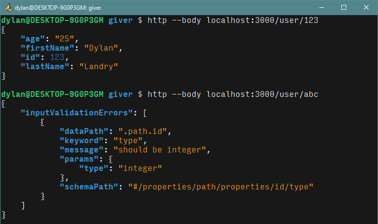

# Validate rest with openapi

Using [express-openapi-validator](https://www.npmjs.com/package/express-openapi-validator), you can add a validation middleware to your api that is automatically generated according to an openapi spec.

**Here's the express code:**

**Here's the openapi spec:**

**And here's the result:**

